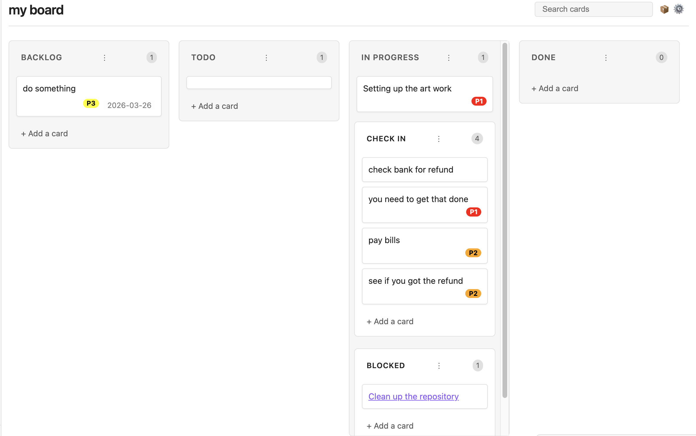

# Obsidian Kanban

A modern, feature-rich Kanban board for Obsidian.

Create and manage your projects with a simple, intuitive drag-and-drop interface directly within your Obsidian vault.

## Features

- **Markdown-Backed**: All your board data is stored in standard Markdown files.
- **Interactive UI**: Responsive drag-and-drop interface for managing lanes and cards.
- **Sub-swimlanes**: Organize complex workflows with nested lanes. Perfect for grouping "Active" and "Slow" tasks under "In Progress."
- **Search and Filter**: Easily find cards with the built-in search bar.
- **Date Management**: Add and manage dates on your cards with a native calendar picker.
- **Note Integration**: Quickly create new notes from Kanban cards.
- **Customizable**: Define your own lanes, lane widths, and date formats.

## Installation

1. Search for "Obsidian Kanban" in the Community Plugins tab in Obsidian settings.
2. Install and enable the plugin.

## Usage

### Creating Sub-swimlanes

You can create sub-swimlanes in two ways:

1. **In Settings**: Go to the board settings (gear icon) and use a `-` prefix for any lane you want to nest under the previous one. For example:

    ```text
    Backlog
    Todo
    In Progress
    - Active
    - Slow
    Done
    ```

2. **In Markdown**: Use different heading levels. H2 headings create top-level lanes, and H3+ headings create sub-lanes nested under the preceding H2.

### Managing Priorities

You can configure global default priorities in the Obsidian settings, or customize them per-board via the Board Settings menu (gear icon).

1. **Format:** Define priorities as a list, one per line, using the format `Name, Color`. (e.g., `High, red`, `P1, #ff0000`, `Critical, rgb(255,0,0)`).
2. **Assigning:** Right-click any card to open the context menu and select a priority to assign it. It will render as a colorful badge on the card.
3. **Auto-Grouping:** Enable the **Auto group by priority** setting to strictly enforce priority sorting within lanes. Drag-and-drop will intelligently reject moves that violate the sorting order, ensuring your highest-priority tasks are always at the top.
4. **Deleting Priorities:** If you remove a priority from your settings, data is preserved! The card will retain a standard markdown tag (e.g., `#P1`), and will simply be grouped as "unassigned" if auto-grouping is enabled. Add the priority back to your settings, and the board will instantly re-render the badges and re-sort them automatically.

## Configuration & Feature Flags

The plugin includes several configuration options and feature flags to customize your experience. These can be found in the Obsidian settings under **Community plugins → Obsidian Kanban**.

- **Add card button in header**: (Enabled by default) Adds a button to the header for creating new cards. This saves vertical space, especially in long lanes.
- **Auto group by priority**: Automatically sorts cards by their assigned priority within each lane.
- **Hide tags in card titles**: Visually removes hashtags from card titles while keeping them in the underlying markdown.
- **Show linked page metadata**: Displays frontmatter metadata from any notes linked in a card.

## Screen Shots

### Main Board


### Sub-swimlanes


### Priorities

<!-- TODO: Add a screenshot of the new priority badges and right-click menu here -->


