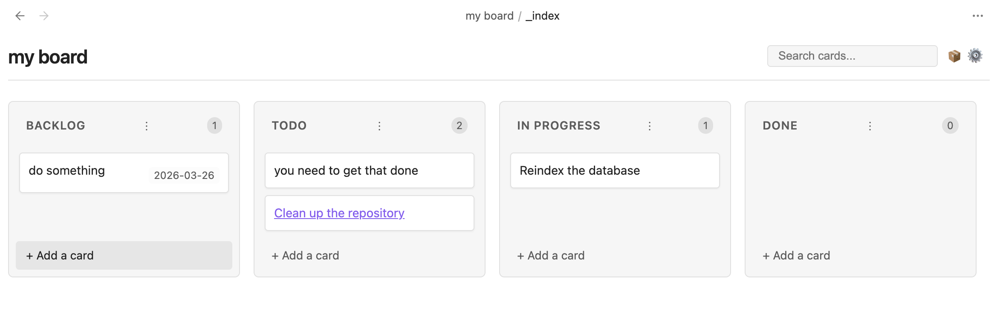
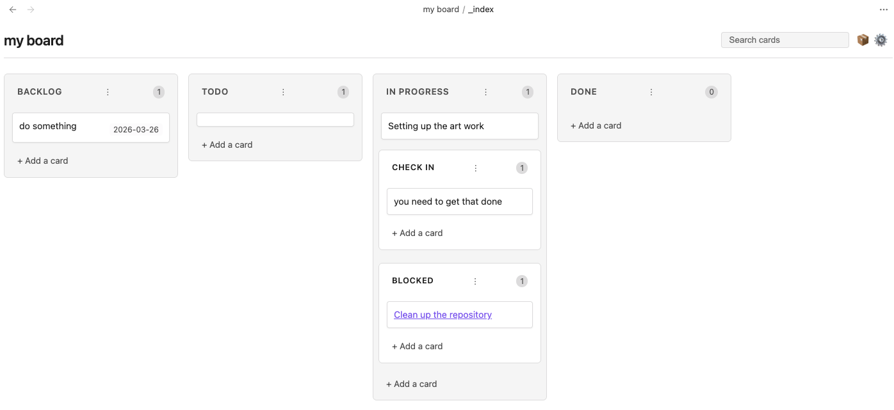

# Obsidian Kanban

A modern, feature-rich Kanban board for Obsidian.

Create and manage your projects with a simple, intuitive drag-and-drop interface directly within your Obsidian vault.

## Features

- **Markdown-Backed**: All your board data is stored in standard Markdown files.
- **Interactive UI**: Responsive drag-and-drop interface for managing lanes and cards.
- **Sub-swimlanes**: Organize complex workflows with nested lanes. Perfect for grouping "Active" and "Slow" tasks under "In Progress."
- **Search and Filter**: Easily find cards with the built-in search bar.
- **Date Management**: Add and manage dates on your cards with a native calendar picker.
- **Note Integration**: Quickly create new notes from Kanban cards.
- **Customizable**: Define your own lanes, lane widths, and date formats.

## Installation

1. Search for "Obsidian Kanban" in the Community Plugins tab in Obsidian settings.
2. Install and enable the plugin.

## Usage

### Creating Sub-swimlanes

You can create sub-swimlanes in two ways:

1.  **In Settings**: Go to the board settings (gear icon) and use a `- ` prefix for any lane you want to nest under the previous one. For example:
    ```text
    Backlog
    Todo
    In Progress
    - Active
    - Slow
    Done
    ```
2.  **In Markdown**: Use different heading levels. H2 headings create top-level lanes, and H3+ headings create sub-lanes nested under the preceding H2.


## Screen Shots

### Main Board



### Sub-swimlanes


